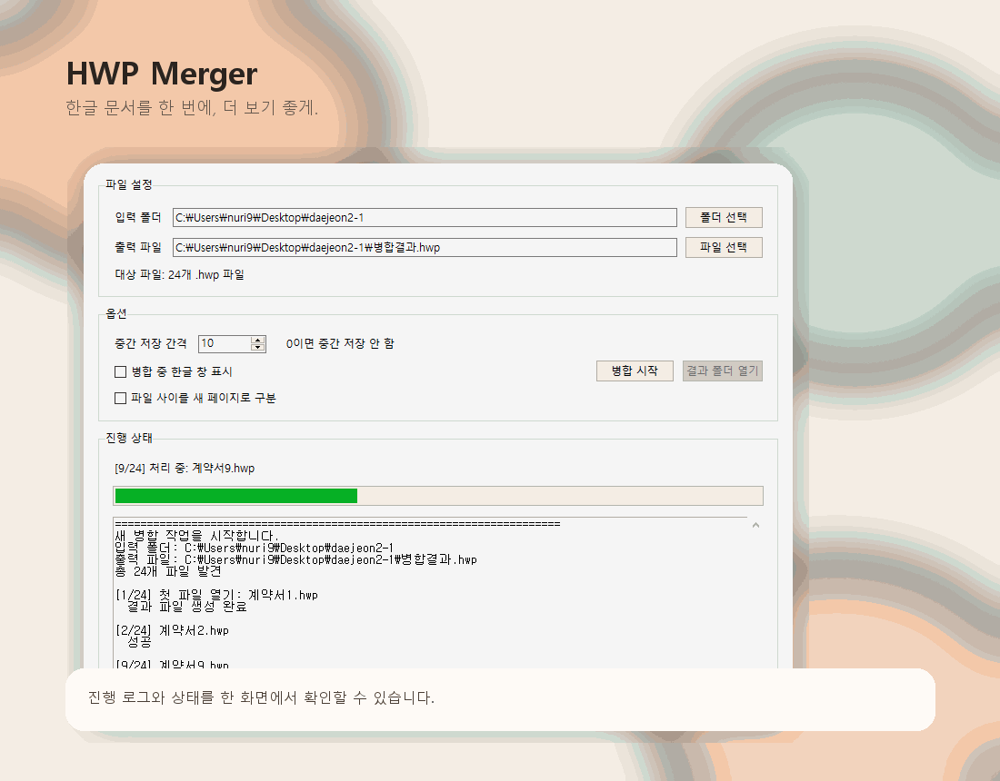
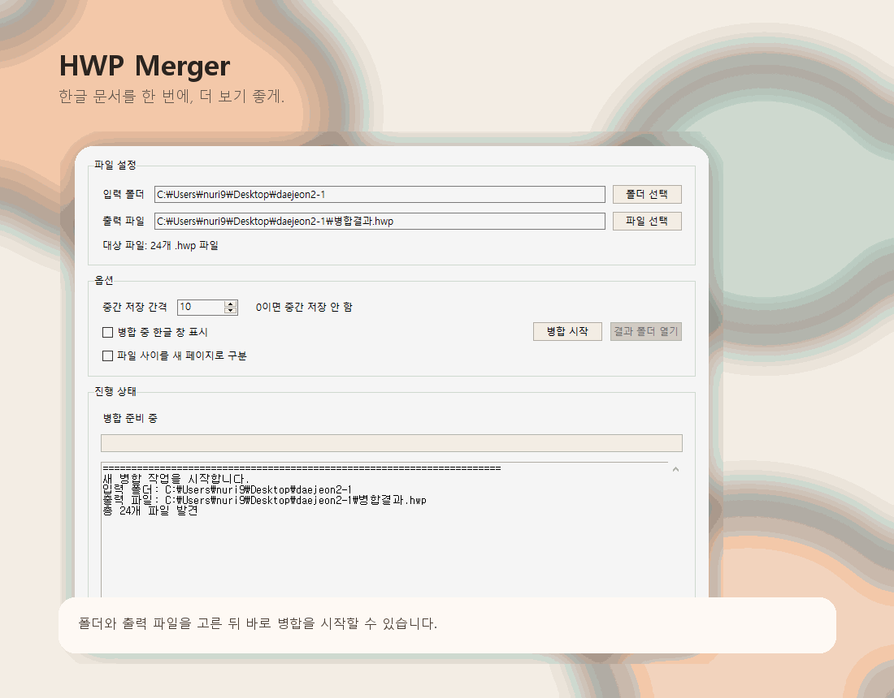

<div align="center">

# ✨ HWP Merger

한글 문서를 한 번에, 더 보기 좋게.

[](./)
[](./)
[](./hwp_merger_gui.py)
[](./dist/HwpMerger.exe)
[](https://github.com/lzpxilfe/hwpmerger/releases)

폴더 안의 `.hwp` 파일을 **자연 정렬**로 모아서  
GUI, CLI, EXE 형태로 편하게 병합할 수 있는 도구입니다.

</div>

## 🖼️ Preview

<p align="center">
  
</p>

## 🎬 Demo

<p align="center">
  
</p>

## 🌸 Highlights

| 기능 | 설명 |
| --- | --- |
| 🖥️ GUI 지원 | 입력 폴더, 출력 파일, 옵션을 화면에서 쉽게 설정 |
| ⚡ CLI 지원 | 명령어 한 줄로 빠르게 실행 가능 |
| 📦 EXE 제공 | Python 없이 실행 가능한 `HwpMerger.exe` 포함 |
| 🔢 자연 정렬 | `1`, `2`, `10` 같은 파일명도 사람이 기대하는 순서로 정렬 |
| 💾 안전 저장 | 임시 작업 파일에 먼저 저장한 뒤 최종 결과 파일로 교체 |
| 👀 자동 가시성 보정 | 숨은 확인창 때문에 멈춰 보이지 않도록 필요 시 한글 창 자동 표시 |
| 📜 진행 로그 | 병합 상태와 처리 흐름을 한 화면에서 확인 가능 |

## 🚀 Quick Start

### GUI 실행

```powershell
python hwp_merger_gui.py
```

또는 [`run_merge_hwp.bat`](./run_merge_hwp.bat)을 더블클릭해도 됩니다.

### EXE 실행

Python 없이 실행하려면 아래 파일을 사용하면 됩니다.

- [`dist/HwpMerger.exe`](./dist/HwpMerger.exe)

## 🧰 Requirements

다음 환경이 필요합니다.

1. Windows
2. 한글(HWP) 설치
3. Python 설치
4. `pywin32` 설치

```powershell
pip install pywin32
```

## 🎛️ GUI에서 할 수 있는 것

- 📂 입력 폴더 선택
- 📝 출력 파일 위치와 이름 지정
- 🔍 실제 병합 대상 `.hwp` 파일 개수 확인
- 💾 중간 저장 간격 설정
- 👁️ 병합 중 한글 창 표시 여부 선택
- 📄 파일 사이 새 페이지 구분 여부 선택
- 📜 진행 로그와 상태 확인
- 🛡️ 보안 모듈 등록 실패 시 한글 창 자동 표시

## 💻 CLI Usage

### 기본 실행

```powershell
python merge_hwp.py "C:\Users\nuri9\Desktop\daejeon2-1"
```

### 출력 파일 직접 지정

```powershell
python merge_hwp.py "C:\Users\nuri9\Desktop\daejeon2-1" --output-file "D:\merged\전체병합.hwp"
```

### 병합 중 한글 창 표시

```powershell
python merge_hwp.py "C:\Users\nuri9\Desktop\daejeon2-1" --show-hwp
```

### 파일 사이를 새 페이지로 구분

```powershell
python merge_hwp.py "C:\Users\nuri9\Desktop\daejeon2-1" --page-break
```

## ⚙️ How It Works

1. 입력 폴더에서 `.hwp` 파일을 찾습니다.
2. 파일명을 자연 정렬로 정렬합니다.
3. 첫 파일을 기준으로 작업용 임시 결과 파일을 만듭니다.
4. 나머지 파일을 순서대로 이어 붙입니다.
5. 필요하면 중간 저장을 수행합니다.
6. 완료 후 최종 결과 파일로 안전하게 교체합니다.

## 📦 Build EXE

직접 EXE를 다시 만들고 싶다면:

```powershell
pyinstaller --noconfirm HwpMerger.spec
```

또는 [`build_exe.bat`](./build_exe.bat)을 실행하면 됩니다.

## 🪄 Releases

릴리즈 페이지:

- [GitHub Releases](https://github.com/lzpxilfe/hwpmerger/releases)

현재 저장소에는 바로 실행 가능한 [`dist/HwpMerger.exe`](./dist/HwpMerger.exe)도 함께 들어 있습니다.  
정식 배포를 올릴 때는 GitHub Releases에 `HwpMerger.exe`를 첨부하는 흐름을 추천합니다.

## 🧩 Project Structure

- [`hwp_merger_gui.py`](./hwp_merger_gui.py): GUI 실행 파일
- [`merge_hwp.py`](./merge_hwp.py): CLI 실행 파일
- [`hwp_merge_core.py`](./hwp_merge_core.py): 공통 병합 로직
- [`HwpMerger.spec`](./HwpMerger.spec): PyInstaller 빌드 설정
- [`build_exe.bat`](./build_exe.bat): EXE 재빌드 배치 파일
- [`tools/generate_readme_assets.py`](./tools/generate_readme_assets.py): README용 프리뷰 이미지/GIF 생성 스크립트

## 📝 Notes

- 기본값은 **파일을 그대로 이어 붙이기**입니다.
- 필요할 때만 옵션으로 **파일 사이 새 페이지 구분**을 넣을 수 있습니다.
- 출력 파일이 입력 폴더 안에 이미 있으면, 입력 목록에서 제외한 뒤 덮어씁니다.
- 병합 중에는 GUI 창 닫기를 막아 작업이 꼬이지 않도록 했습니다.

## 💖 Recommended For

- 여러 `.hwp` 문서를 매번 수동으로 합치기 번거로운 분
- 폴더 단위로 문서를 정리해서 한 번에 병합하고 싶은 분
- EXE 파일만 실행해서 간단히 쓰고 싶은 분

---

<div align="center">
보기 좋고 쓰기 편한 한글 병합 도구를 목표로 계속 다듬는 중입니다.
</div>
