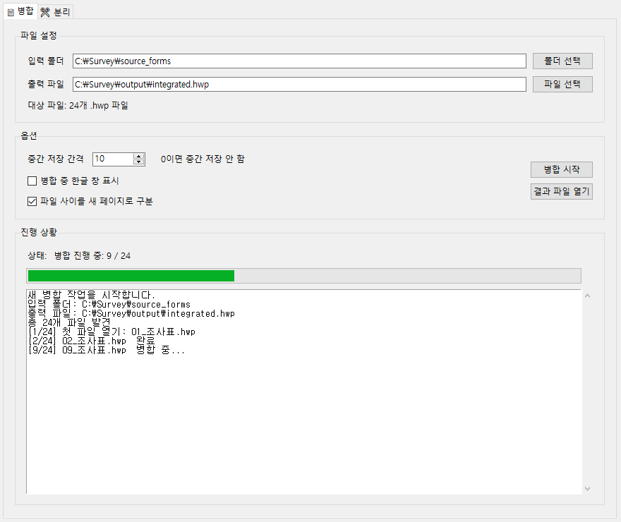
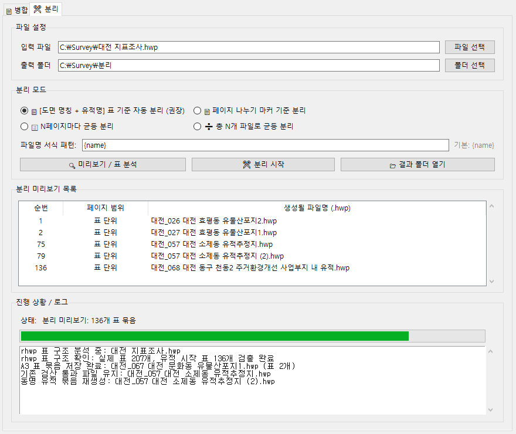

# HWP Merger / Splitter

Windows용 한글(HWP) 문서 도구입니다. 폴더 안의 HWP 파일을 순서대로 **병합**하거나, 한 문서 안에 반복된 조사표·유적표 같은 **표 묶음**을 각각의 HWP 파일로 분리합니다.

> 한글(HWP)이 설치된 Windows PC에서 사용합니다. 원본 문서는 수정하지 않습니다.


## 할 수 있는 일

| 기능 | 하는 일 |
| --- | --- |
| 폴더 병합 | 폴더 안의 `.hwp` 파일을 사람 눈에 자연스러운 파일명 순서로 하나의 HWP로 병합합니다. |
| 표 묶음 분리 | `도면 명칭 + 유적명`이 들어 있는 시작 표부터 다음 시작 표 직전까지의 실제 표를 하나의 HWP로 저장합니다. |
| A3·사진 보존 | 분리본을 A3 바탕 문서에 저장하고, 한 유적에 딸린 사진표·추가 표도 함께 가져갑니다. |
| 자동 파일명 | 표의 `도면 명칭 + 유적명`을 파일명으로 사용합니다. 같은 이름이 반복되면 ` (2)`, ` (3)`을 붙여 모두 보존합니다. |
| 안전한 재실행 | 검산을 통과한 기존 분리 파일은 유지하고, 누락·실패한 파일만 다시 만듭니다. |

## 화면 예시

### 1. 폴더 병합

입력 폴더와 결과 파일을 고른 뒤 병합합니다. 파일 사이에 새 페이지를 넣거나, 일정 개수마다 중간 저장하는 옵션을 선택할 수 있습니다.



예를 들어 아래 폴더를 선택하면:

```text
C:\Survey\source_forms
 ├─ 01_조사표.hwp
 ├─ 02_조사표.hwp
 └─ 10_조사표.hwp
```

파일명 순서대로 병합하여 다음 파일을 만듭니다.

```text
C:\Survey\output\integrated.hwp
```

### 2. 표 묶음 분리

조사표가 반복되는 큰 HWP 하나를 선택하고 결과 폴더를 지정합니다. **`[도면 명칭 + 유적명] 표 기준 자동 분리`**를 선택한 뒤 먼저 **미리보기 / 표 분석**을 실행하세요. 미리보기의 `표 단위` 항목 하나가 결과 HWP 한 개입니다.



예를 들어 한 유적의 정보가 기본 표와 사진 표, 두 표로 이루어졌다면 두 표를 같은 파일에 저장합니다.

```text
원본 표 순서
 ├─ 대전_057 / 대전 소제동 유적추정지 / 기본 표
 ├─ 사진 표
 ├─ 대전_057 / 대전 소제동 유적추정지 / 다시 사용된 이름의 기본 표
 └─ 사진 표

결과
 ├─ 대전_057 대전 소제동 유적추정지.hwp
 └─ 대전_057 대전 소제동 유적추정지 (2).hwp
```

분리 분석은 본문 전체를 훑지 않고 `rhwp`로 문서의 실제 표 구조를 읽습니다. 저장 후에는 제목 표와 표 개수를 다시 확인하므로, 빈 파일·원본 전체 복사·사진 표 누락을 정상 결과로 처리하지 않습니다.

## 가장 쉬운 실행 방법: 내려받고 `run.bat` 누르기

### 준비물

1. Windows
2. 한글(HWP) 프로그램 설치
3. Python 3.10~3.13 설치 및 PATH 등록

처음 한 번만 명령 프롬프트 또는 PowerShell에서 다음을 실행합니다.

```powershell
python -m pip install pywin32
```

### 실행 순서

1. 이 저장소에서 **Code → Download ZIP**을 눌러 내려받습니다.
2. ZIP을 원하는 위치에 모두 풉니다. `tools`, `resources` 폴더도 함께 있어야 합니다.
3. 폴더 안의 [`run.bat`](./run.bat)을 더블클릭합니다.
4. `병합` 또는 `분리` 탭을 고르고 화면의 입력 경로와 출력 경로를 설정합니다.

`run.bat`은 `pythoncom`이 설치된 Python을 찾아 실행합니다. 여러 Python이 설치되어 있다면, `python --version`으로 확인한 같은 Python 환경에 `python -m pip install pywin32`를 실행하세요.

## 표 묶음 분리 사용 순서

1. `분리` 탭에서 원본 `.hwp` 파일과 결과 폴더를 선택합니다.
2. **`[도면 명칭 + 유적명] 표 기준 자동 분리 (권장)`** 모드를 선택합니다.
3. **`미리보기 / 표 분석`**을 눌러 파일명, 항목 수, 마지막 항목을 확인합니다.
4. **`분리 시작`**을 누릅니다.

작업 중 한글 창이 잠시 열릴 수 있습니다. 표·그림 개체를 실제로 복사하는 과정이므로, 작업이 끝날 때까지 한글 창과 프로그램 창을 닫지 마세요.

동일한 결과 폴더로 다시 실행해도 이미 검산된 결과는 유지합니다. 다만 동명 유적이 있고 ` (2)` 파일이 없는 경우에는, 어느 쪽이 기존 기본 파일인지 혼동하지 않도록 그 동명 묶음만 다시 생성합니다.

## 명령줄 병합

명령줄은 폴더 병합에 사용할 수 있습니다.

```powershell
python merge_hwp.py "C:\Survey\source_forms"
```

출력 파일을 직접 정하고 파일 사이에 새 페이지를 넣으려면:

```powershell
python merge_hwp.py "C:\Survey\source_forms" `
  --output-file "C:\Survey\output\integrated.hwp" `
  --page-break
```

자세한 옵션은 다음으로 확인합니다.

```powershell
python merge_hwp.py --help
```

## EXE를 직접 만들기

Python 없이 실행할 EXE가 필요하면 이 저장소에서 직접 빌드할 수 있습니다. **EXE를 실행하는 PC에는 Python이 필요 없지만, 한글(HWP)은 반드시 설치되어 있어야 합니다.**

### 1. 빌드 환경 설치

```powershell
python -m pip install pywin32 pyinstaller
```

### 2. 빌드

[`build_exe.bat`](./build_exe.bat)을 더블클릭하거나 다음을 실행합니다.

```powershell
python -m PyInstaller --noconfirm HwpMerger.spec
```

성공하면 최신 실행 파일이 다음 위치에 만들어집니다.

```text
dist\HwpMerger.exe
```

이 빌드 설정은 표 구조 분석기(`rhwp`)와 A3 바탕 문서를 EXE 안에 함께 포함합니다. 따라서 EXE를 배포할 때 별도로 `tools`나 `resources` 폴더를 복사할 필요는 없습니다.

## 자주 묻는 문제

| 증상 | 확인할 점 |
| --- | --- |
| `Python` 또는 `pywin32` 오류 | `python -m pip install pywin32`를 실행하고 `run.bat`을 다시 실행합니다. |
| 표 분석 엔진을 찾지 못함 | 소스 파일 하나만 받지 말고 저장소 전체 ZIP을 다시 내려받아 압축을 풉니다. |
| 분리 결과가 멈춘 것처럼 보임 | 한글의 보안·버전 확인 창이 다른 창 뒤에 있을 수 있습니다. 한글 창을 확인하고 작업 창을 닫지 마세요. |
| 파일 수가 인식 수보다 하나 적음 | 같은 `도면 명칭 + 유적명`이 반복된 경우입니다. 최신 버전은 두 번째부터 ` (2)`를 붙입니다. |
| A3 표가 잘림 | 최신 버전으로 다시 실행하세요. 분리본은 A3 바탕 문서를 사용하며, 저장 뒤 검산을 통과해야 결과 파일로 확정됩니다. |

## 프로젝트 구성

| 파일·폴더 | 설명 |
| --- | --- |
| [`hwp_merger_gui.py`](./hwp_merger_gui.py) | 병합·분리 GUI |
| [`hwp_merge_core.py`](./hwp_merge_core.py) | HWP 병합 로직 |
| [`hwp_split_core.py`](./hwp_split_core.py) | 실제 표 묶음 분석·분리·검산 로직 |
| [`merge_hwp.py`](./merge_hwp.py) | 명령줄 병합 도구 |
| [`run.bat`](./run.bat) | 소스 버전 GUI 실행 |
| [`build_exe.bat`](./build_exe.bat) | PyInstaller EXE 빌드 |
| [`HwpMerger.spec`](./HwpMerger.spec) | EXE에 포함할 실행 파일·A3 바탕 설정 |
| [`tools/rhwp`](./tools/rhwp) | 표 구조 분석에 사용하는 `rhwp` 실행 파일 및 MIT 라이선스 |
| [`tools/generate_readme_assets.py`](./tools/generate_readme_assets.py) | README의 병합·분리 화면 스크린샷 생성 스크립트 |

README 화면을 다시 만들 때만 `python -m pip install pillow`를 추가로 실행하면 됩니다. 이는 프로그램 실행이나 EXE 사용에는 필요하지 않은 개발용 의존성입니다.

## 감사와 인용

표 구조 분석에는 [rhwp](https://github.com/edwardkim/rhwp)를 사용합니다. 포함된 실행 파일의 라이선스는 [`tools/rhwp/rhwp/LICENSE`](./tools/rhwp/rhwp/LICENSE)에 보관합니다.

연구·수업·현장 업무에 이 저장소를 활용했다면 GitHub의 **Cite this repository** 기능 또는 [`CITATION.cff`](./CITATION.cff)을 이용해 주세요.
